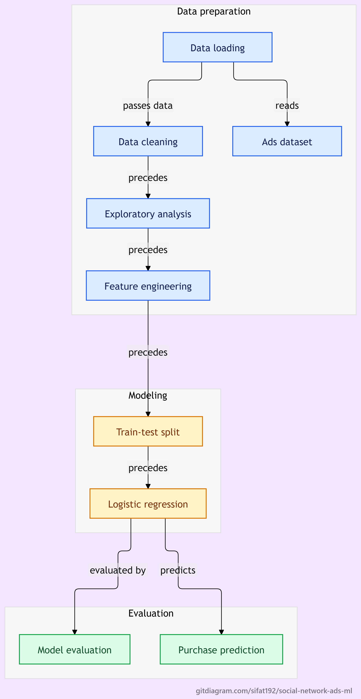

# Social Network Ads Purchase Prediction

## Project Overview
This project builds a **Machine Learning classification model** to predict whether a user will purchase a product based on demographic information such as **Age, Gender, and Estimated Salary**.

The model uses **Logistic Regression**, a widely used algorithm for binary classification problems.

---

## Dataset

The dataset used is the **Social Network Ads Dataset**.

### Features

| Feature | Description |
|------|-------------|
| User ID | Unique identifier for each user |
| Gender | Male or Female |
| Age | Age of the user |
| EstimatedSalary | Annual salary of the user |
| Purchased | Target variable (0 = Not Purchased, 1 = Purchased) |

---

## Project Workflow

1. Data Loading
2. Data Cleaning
3. Exploratory Data Analysis (EDA)
4. Feature Engineering
5. Train-Test Split
6. Model Training using Logistic Regression
7. Model Evaluation

---
## Classification Workflow

The diagram outlines data cleaning, exploratory analysis,
feature engineering, and train-test splitting, followed by
logistic regression, model evaluation, and purchase prediction.

  

[View full-size diagram](social-network-ads-workflow.png)
---

## Technologies Used

- Python
- Pandas
- Matplotlib
- Seaborn
- Scikit-learn
- Jupyter Notebook

---

## Model

The model used is **Logistic Regression** from the `scikit-learn` library.

Logistic regression is suitable for this problem because:

- The target variable is **binary**
- It provides **interpretable results**
- It performs well for classification problems

---

## Model Evaluation

The model is evaluated using:

- Accuracy
- Confusion Matrix
- F1 Score

These metrics help measure the performance of the classification model.

---

## Results

The Logistic Regression model successfully predicts whether a customer is likely to purchase a product based on their demographic attributes.

The results demonstrate how **age and salary can influence purchasing behavior**.
